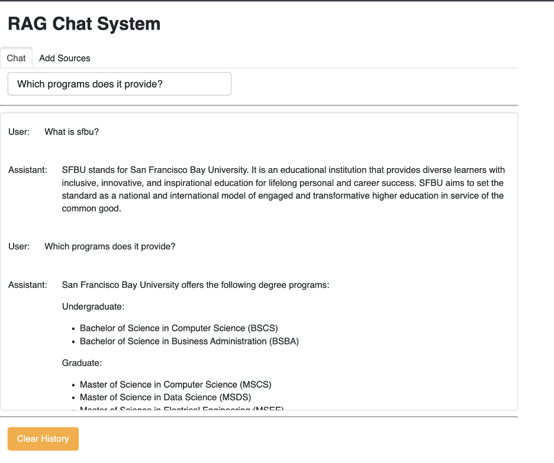

# RAG (Retrieval-Augmented Generation) Chatbot Project

## Overview
This project implements a Retrieval-Augmented Generation (RAG) approach to create an intelligent chatbot capable of answering questions using document-based knowledge. By combining embeddings, vector stores, and similarity search, the chatbot efficiently retrieves relevant information and provides context-aware responses.

---

## Features

### Document Processing
- **Multiple Format Support**:
  - PDF Documents: Process academic papers, reports, and books.
  - YouTube Videos: Automatic transcription for content extraction.
  - Web Pages: Extract content directly using URLs.
  - Extensible architecture for adding support for other formats.
  
### Intelligent Search
- **Vector-based Semantic Search**: Utilizes OpenAI embeddings for accurate document retrieval.
- **Source Attribution**: Ensures transparency by linking responses to their source documents.
- **Context-Aware Responses**: Maintains relevance in follow-up questions using conversational memory.

### User Interface
- **Clean Web Interface**: Intuitive design for seamless interaction.
- **Real-Time Feedback**: Displays processing status during document uploads and searches.
- **Chat History Management**: Tracks user interactions and responses.
- **Source Management**: Allows viewing and managing uploaded documents.

---

## Key Concepts

1. **Data Loading**: Documents are split into semantically meaningful chunks for efficient retrieval.
2. **Embeddings and Vector Stores**: Numerical representations of text enable similarity searches. A vector store serves as a database for embeddings.
3. **Similarity Search**: Finds relevant document chunks based on user queries.
4. **Edge Cases**:
   - **Diversity Failures**: Addressed using techniques like Maximum Marginal Relevance (MMR) and clustering.
   - **Specificity Failures**: Handled by metadata-driven retrievers and compression methods.

---

## Usage

### Installation
1. **Create Virtual Environment**
  ```bash
  python -m venv venv
  ```

2. **Install Dependencies**
  ```bash
  pip install -r requirements.txt
  ```

3. **Configure OpenAI API**

  Create a .env file:
  ```bash
  OPENAI_API_KEY=your_api_key_here
  ```
4. **Install System Dependencies**
  
  ffmpeg (for YouTube processing), On macOS:
  ```bash
  brew install ffmpeg
  ```
5. **Start the application:**
  ```bash
  python start.py
  ```

## Sample Output


## Documentation
GitHub Link: 
https://github.com/YinYinPhyo/RAG-Chat-Customer-Support-System

Presentation Slide:
https://drive.google.com/file/d/1dWQZFkNbpjyR9evyn_rUEmIfRWav97cU/view?usp=sharing
